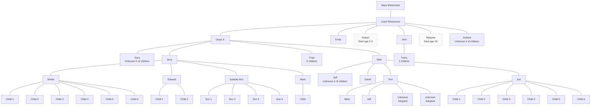

# Weisensee Family Tree

graph TD
    Mary[Mary Weisensee] --- Lloyd[Lloyd Weisensee]
    ...

```mermaid
graph TD
    Mary[Mary Weisensee] --- Lloyd[Lloyd Weisensee]

    Lloyd --- Lloyd_Jr[Lloyd Jr.]
    Lloyd --- Emily[Emily]
    Lloyd --- Robert[Robert<br>Died age 2-3]
    Lloyd --- John[John]
    Lloyd --- Marjorie[Marjorie<br>Died age 18]
    Lloyd --- Andrea[Andrea<br>Unknown # of children]

    Lloyd_Jr --- Sara[Sara<br>Unknown # of children]
    Lloyd_Jr --- Jerry[Jerry]
    Lloyd_Jr --- Fred[Fred<br>0 children]
    Lloyd_Jr --- Matt[Matt]

    John --- Twins[Twins<br>2 children]

    Jerry --- Sheila[Sheila]
    Jerry --- Edward[Edward]
    Jerry --- Isabella_Ann[Isabella Ann]
    Jerry --- Mark_J[Mark]

    Matt --- Jeff[Jeff<br>Unknown # of children]
    Matt --- David[David]
    Matt --- Tom[Tom]
    Matt --- Joe[Joe]

    Sheila --- Sheila_Child1[Child 1]
    Sheila --- Sheila_Child2[Child 2]
    Sheila --- Sheila_Child3[Child 3]
    Sheila --- Sheila_Child4[Child 4]
    Sheila --- Sheila_Child5[Child 5]
    Sheila --- Sheila_Child6[Child 6]

    Edward --- Edward_Child1[Child 1]
    Edward --- Edward_Child2[Child 2]

    Isabella_Ann --- Isabella_Son1[Son 1]
    Isabella_Ann --- Isabella_Son2[Son 2]
    Isabella_Ann --- Isabella_Son3[Son 3]
    Isabella_Ann --- Isabella_Son4[Son 4]

    Mark_J --- Mark_Child[Child]

    Tom --- Tom_Child1[Mark]
    Tom --- Tom_Child2[Jeff]
    Tom --- Tom_Child3[Unknown<br>Adopted]
    Tom --- Tom_Child4[Unknown<br>Adopted]

    Joe --- Joe_Child1[Child 1]
    Joe --- Joe_Child2[Child 2]
    Joe --- Joe_Child3[Child 3]
    Joe --- Joe_Child4[Child 4]
    Joe --- Joe_Child5[Child 5]
    Joe --- Joe_Child6[Child 6]

    classDef deceased fill:#f9f9f9,stroke:#999,stroke-dasharray: 5 5
    class Robert,Marjorie deceased
```
